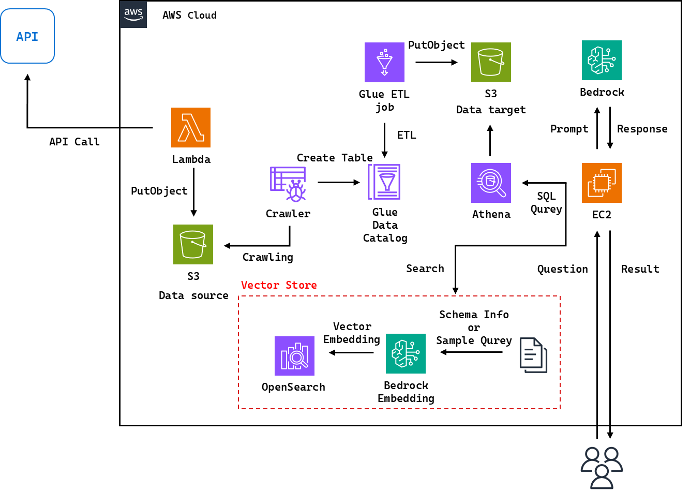
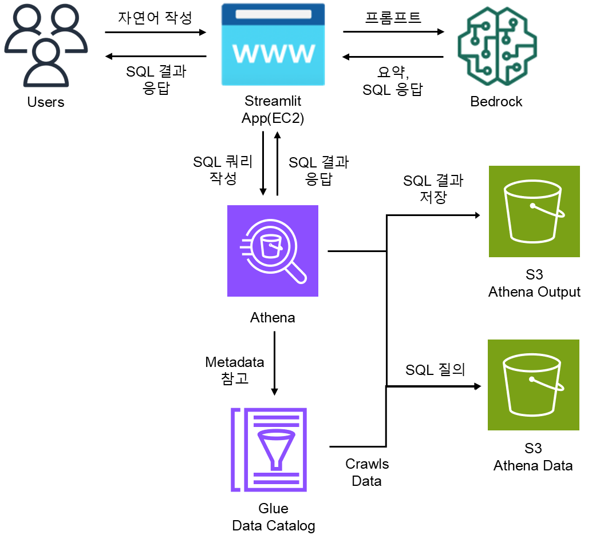

# 🚀 AWS Bedrock으로 만드는 Text2SQL 시스템
이 문서는 자연어(Natural Language)로 데이터베이스에 질문을 던지고, 이에 대해 SQL 쿼리를 자동으로 생성하여 분석 결과를 반환하는 Text-to-SQL 시스템을 AWS 환경에서 직접 구현하는 실습 가이드입니다.

Amazon Bedrock의 생성형 AI 기능과 Athena, Glue, S3 등 주요 AWS 서비스를 연계하여, SQL을 몰라도 누구나 데이터 분석이 가능한 환경을 만드는 것이 목표이며, Streamlit 기반의 웹 UI를 통해 사용자는 자연어로 질문하고, 시스템은 이를 분석하여 자동으로 쿼리 실행 및 결과를 반환합니다.

## 📋 목차
- [소개](#-소개)
- [아키텍처](#-아키텍처)
- [조건 사항](#-조건-사항)
- [프로젝트 구조](#-프로젝트-구조)
- [실행 방법](#-실행-방법)

## 🎯 소개
## 🎯 소개
먼저, Glue, S3를 사용하여 DataLake 환경을 구성하였고, Amazon Bedrock과 Generative AI를 사용하여 사용자가 Streamlit APP(EC2)에서 자연어 질문을 통해 Amazon Athena를 사용하여 S3에 쿼리하는 방법을 정리하였습니다.
해당 구성의 자세한 설명은 [velog](https://velog.io/@dongs52/AWS-Bedrock-Agent%EB%A5%BC-%EC%82%AC%EC%9A%A9%ED%95%9C-Text-to-SQL-%EB%A7%8C%EB%93%A4%EA%B8%B0)블로그에 정리를 하였습니다.

## 🏗 아키텍처
#### 전체 아키텍처

본 실습에서는 Lambda를 활용한 실시간 데이터 수집 대신, S3에 정적 예제 데이터를 업로드하여 데이터 파이프라인 전반과 Bedrock을 사용한 SQL 쿼리 생성을 검증하였습니다.

#### Text-to-SQL 아키텍처

Text-to-SQL 부분을 더 자세하게 풀어낸 아키텍처입니다.

## 🐞 조건 사항
 - **AWS**
    - 리전은 `ap-northeast-2` 서울 리전을 사용하였습니다.

 - **EC2**
    - 환경은 `AmazonLinux2023`으로 진행을 하였고, Python버전은 `3.9.18`버전으로 진행하였습니다.
    - 필수로 설치해야 할 패키지가 없다면 실행이 불가능한 점을 유의해야 합니다.
    - 본 구성에서는 접속 테스트는 EC2에 EIP를 통해 바로 접속을 하였습니다.
        - 필요 시 ELB 를 구성하여 사용합니다.

 - **IAM**
    - 각 서비스마다 필요한 Policy는 블로그를 참고하며 진행을 하고 필요한 권한이 없다면 `Glue`, `Bedrock`, `Streamlit App(EC2)`에서 에러가 발생합니다.

 - **Glue**
    - ETL 작업 시 spark가 아닌 python으로 진행 시 추가적인 라이브러리는 S3에 업로드 후 실행시킬 수 있습니다.

 - **Bedrock**
    - Amazon Bedrock을 이용하기 위해 Bedrock configurations **모델 액세스를 활성화**해야 합니다.
    - 에이전트 지침을 잘못 설정한다면, 원하는 답변이 나오지 않을 수 있습니다.

## 📁 프로젝트 구조
```tree
.
├── README.md
├── sample_knowledge-bases # Bedrock 지식 기반에서 사용할 샘플 쿼리 및 스키마
│   ├── sample_query.txt
│   └── sample_schema.txt
├── sample_data # Glue 에서 크롤링 후 join할 데이터
│   ├── user_info
│   │   └── user_info.jsonl
│   ├── add_info
│   │   └── add_info.jsonl
│   └── tmp # 미사용
│       └── sample_1000.json
├── streamlit # Streamlit 애플리케이션 및 필요 패키지
│   ├── app.py
│   └── requirements.txt
├── images # 이미지 파일
│   ├── archtecture.png
│   └── text-to-sql.png
├── etl_script # ETL 작업 시 사용할 스크립트
│   ├── customer-etl-spark.py
│   └── customer-etl-python.py
└── bedrock_agent # Bedrock 에이전트에 대한 지침
    └── agent_instructions.txt
```

## ⚙️ 실행 방법
아래의 과정을 통해 Streamlit App을 실행할 수 있으며, 브라우저에서 애플리케이션에 접근하여 질문을 할 수 있습니다.
```bash
# 홈 디렉토리로 이동
cd ~

# 프로젝트 다운로드 및 디렉토리 이동
git clone https://github.com/Shin9184/text-to-sql.git
cd streamlit

# Python 3.9 기반 가상환경 생성
python3.9 -m venv venv

# 가상환경 활성화
source venv/bin/activate

# requirements.txt에 정의된 패키지 설치
pip3.9 install -r requirements.txt

# 설치된 패키지 목록 확인
pip3.9 list
# 아래 패키지는 필수 설치이며, 의존성에 의해 다른 패키지도 함께 설치가 된다. (작성자 기준)
streamlit==1.45.1
boto3==1.38.19
pandas==2.2.3

# Streamlit 앱 백그라운드 실행, nohup은 터미널 종료 후에도 계속 실행
nohup streamlit run app.py --server.port=8080
```
